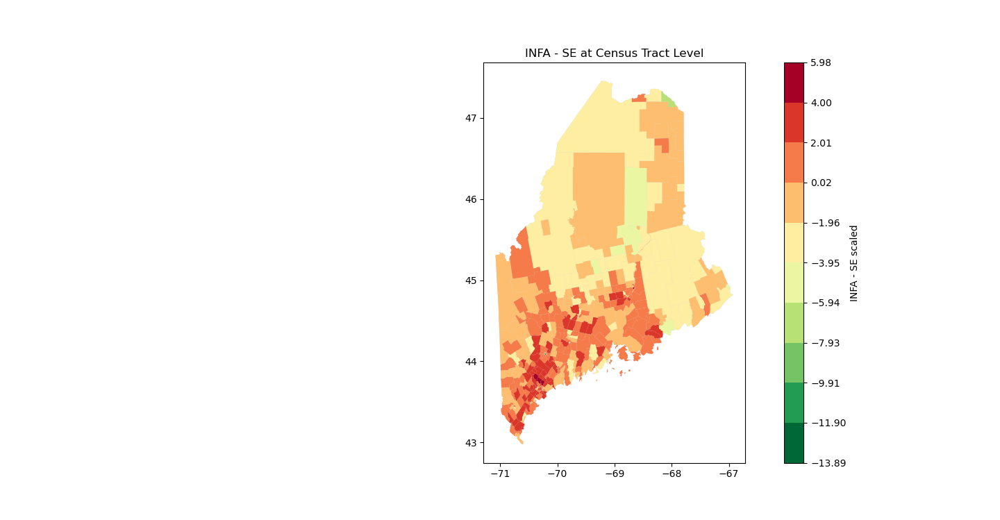

This research builds upon the outcomes of a class project undertaken in DS 5110, which creates a Maine-specific Digital Divide Index (DDI) with collaborators Jeff Cuartas and Yuan Kuang. This was study was based on [Purdue University's Center for Regional Development Digital Divide Index](https://storymaps.arcgis.com/stories/8ad45c48ba5c43d8ad36240ff0ea0dc7) and incorporates insights and work from a [project done in DS 5010](http:ds5010.github.io/broadband-3).


# Findings
Our study has facilitated the identification of key areas where the Maine Connectivity Authority (MCA) should direct infrastructure investment. These critical zones, characterized by an infrastructure score larger than a relative cultural score, have been delineated in darker red in the visual aid. 

If an area has an infrastructure score that is larger than its cultural score, it results in a positive value. This indicates that the infrastructure in the area needs improvement. This means the infrastructure score isn't as high as it should be in relation to the cultural score. 

On the other hand, areas that have a negative value, shown in green, are in need of digital literacy improvement. This suggests that the cultural score of these areas is larger than the infrastructure score. The use of the term 'cultural score' here likely refers to an area's capacity to use and interact with digital technologies, including the general population's digital literacy.

```
make infapop
```



"These two scores are combined to calculate the overall DDI score. If a particular county or census tract has a higher INFA score versus a SE score, efforts should be made to improve broadband infrastructure."


In our analysis, we employed two indices derived from a study conducted by Purdue University: the Socioeconomic Index (SE) and the Infrastructure Index (INFA). These indices aggregate a myriad of information and parameters to evaluate the need for infrastructure enhancements and to identify areas with a deficit in digital literacy. By comparing the INFA and SE scores, we discern whether a region's division is due to inadequate infrastructure vis-à-vis cultural needs, or a relative lack of digital literacy compared to infrastructure availability. Across Maine, our results indicate a consistent trend of infrastructure scarcity when contrasted with cultural needs.


As a vibrant hub of economic and cultural activities, Southern Maine, particularly urban centers such as Portland, play a pivotal role in the state's prosperity. The urban sprawl and its surrounding regions are experiencing population growth and increasing diversity in needs, necessitating substantial enhancements to existing infrastructure.


We strongly advocate for the MCA's targeted investment in these darker red regions in the map above as a strategic step towards improving Maine's overall infrastructure, thereby bolstering its cultural vitality and enhancing the quality of life for its residents.
